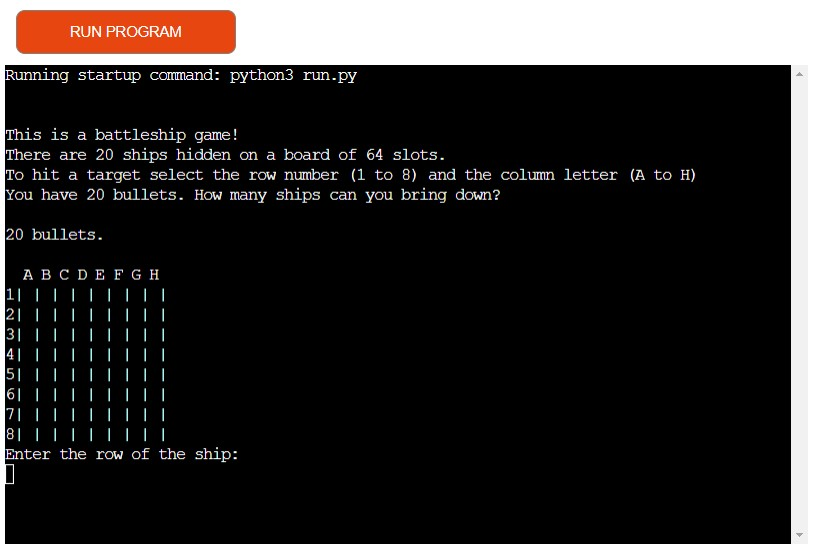
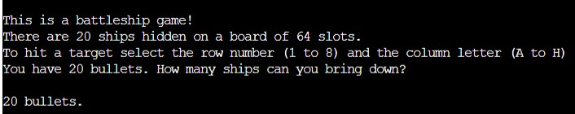
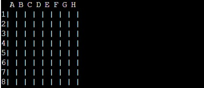
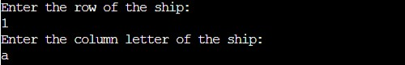
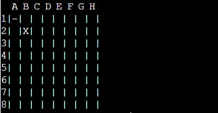
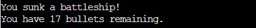
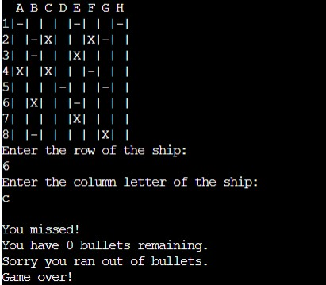
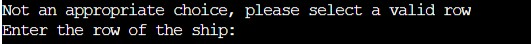
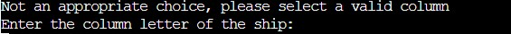
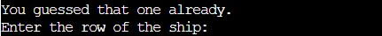

# **A Game of Battleships**

## **Game Intro**

A simple battleships terminal game, playable against the computer for people of all ages.

**The game website is live on Heroku apps [Linked Here](https://battleships-pp3.herokuapp.com/)**

## **Index**

1. [**Game Intro**](#game-intro)

## **User Stories**

* As a user, I want the game information to be easily accessed.
* As a user, I want the game to be easy to navigate.
* As a user, I want the game to be intuitive.
* As a user, I want the game to have clear rules.
* As a user, I want the game to be entertaining.

## **Features**

### **How to play**

#### **Game rules**

* Right at the start of the game, the user is introduced to the game rules.

[***Back to Index***](#index)

#### **The Game board**

* The game board is a square with a horizontal axis (X) and a vertical axis (Y).
* The horizontal axis (X) is labeled on top of each column with the letter A to H.
* The vertical axis (Y) is numbered on each row from 1 to 8.

#### **Gameplay**

* The user is prompted to choose and insert the row (X) and the column (Y) coordinates to aim on the board.

* After the coordinates have been introduced another board will be printed with the results and let the user know if they hit or miss a ship at the introduced coordinates.
* When the user hits a target is marked with an "X" on the new printed board, otherwise, if they miss it will be marked with an "-".

* After each turn, the number of bullets left is updated and the user is informed whether they hit or miss and how many bullets they have left.

* When the user runs out of bullets the game prints the board one last time and informs the user that they finished all the 20 bullets and the game is over.

* If the user introduces a different row number they will be alerted that they have to chose a valid number.

* If the user introduces a different row column letter they will be alerted that they have to chose a valid letter.

* If the user inserts the same coodinates that they used already, the user is prompted that they guessed those coordinates already.

[***Back to Index***](#index)

## **Testing**

I have manually tested this application by doing the following:

* Passed the code through PEP8 linter and confirmed there is no issues.
* Given wrong letter or number when specific letter is expected.
* Tested in my local terminal and the Code Institute Heroku terminal.

## **Technologies**

* [GitHub](https://github.com/) - used for secure storage of code online
* [Git](https://git-scm.com/) - used for version control
* [Python](https://www.python.org/) - Python is used for creating this application

## **Known Bugs**

* If the user presses enter on both row number or column letter the game will be terminated.

## **Deployment**

This project was deployed using Code Institute's Python mock terminal for Heroku

The steps are as follows:

* Create a new app, by clicking 'New' in the top right section of the welcome page.
* Choose a name for your new application and select your region.
* Go to the Settings tab, and add two buildpacks in this exact order:

1. `heroku/python`
2. `heroku/nodejs`

* Go to 'Deploy' tab and select 'GitHub' as deployment method.
* Locate your repository on 'Github', then select 'connect repository'.
* Chose "Automatic deployment" if you'd like your app to be automatically updated after you do any changes to your code.
* Chose "Manual deployment" if you like to have control when the code is updated to your already deployed app.
* Chose the main branch and click build.

## **Credits**

### **General reference:**

* Besides the course's material I also used W3schools, MDN web docs, Stack Overflow, and Youtube for general or a more in-depth reference.

[***Back to Index***](#index)
